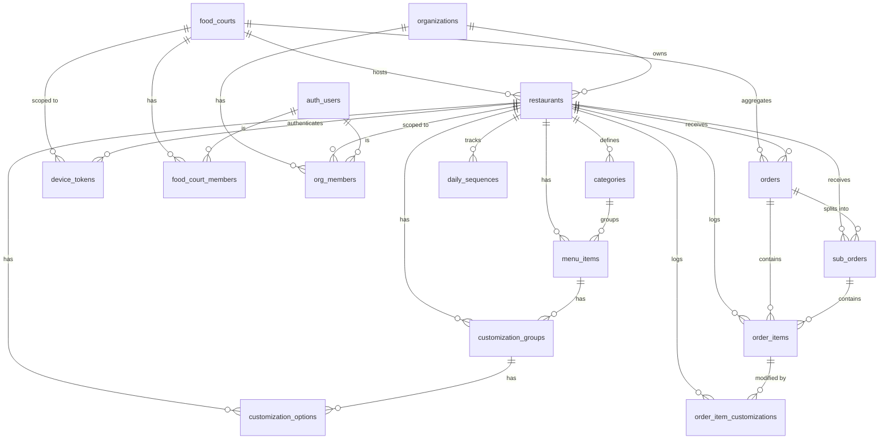

# Kiki — Database Architecture

> Last updated: 2026-05-09  
> Source: Live Supabase introspection via MCP  
> Project: **kiki** · `shmmbnvdtmqxmrlzpluh` · region `us-east-1`

---

## Entity Relationship Diagram



---

## Tables

### `food_courts`
Top-level venue entity. A food court hosts multiple restaurants and can have its own kiosk devices.

| Column | Type | Notes |
|---|---|---|
| `id` | uuid PK | auto |
| `name` | text | |
| `slug` | text | unique |
| `address` | text | nullable |
| `logo_url` | text | nullable |
| `created_at` | timestamptz | default now() |

**Referenced by:** `restaurants.food_court_id`, `orders.food_court_id`, `device_tokens.food_court_id`, `food_court_members.food_court_id`

---

### `food_court_members`
Maps auth users to food courts with a role. Mirrors `org_members` but at the food-court level.

| Column | Type | Notes |
|---|---|---|
| `id` | uuid PK | auto |
| `user_id` | uuid | → `auth.users.id` |
| `food_court_id` | uuid | → `food_courts.id` |
| `role` | text | `owner`, `manager`, `staff`, `kiosk_device` |
| `display_name` | text | nullable |
| `created_at` | timestamptz | default now() |

---

### `organizations`
The tenant root. An organization owns one or more restaurants.

| Column | Type | Notes |
|---|---|---|
| `id` | uuid PK | auto |
| `name` | text | |
| `slug` | text | unique |
| `logo_url` | text | nullable |
| `slogan` | text | nullable, default `''` |
| `welcome_bg_url` | text | nullable, default `''` |
| `created_at` | timestamptz | default now() |

**Referenced by:** `restaurants.org_id`, `org_members.org_id`

---

### `org_members`
Maps auth users to organizations (and optionally to a specific restaurant) with a role.

| Column | Type | Notes |
|---|---|---|
| `id` | uuid PK | auto |
| `user_id` | uuid | → `auth.users.id` |
| `org_id` | uuid | → `organizations.id` |
| `restaurant_id` | uuid | nullable → `restaurants.id` |
| `role` | text | `owner`, `manager`, `staff`, `kiosk_device` |
| `display_name` | text | nullable |
| `created_at` | timestamptz | default now() |

---

### `restaurants`
A single restaurant location. Belongs to an org and optionally to a food court.

| Column | Type | Notes |
|---|---|---|
| `id` | uuid PK | auto |
| `org_id` | uuid | → `organizations.id` |
| `food_court_id` | uuid | nullable → `food_courts.id` |
| `name` | text | |
| `slug` | text | unique |
| `address` | text | nullable |
| `is_open` | boolean | default false |
| `timezone` | text | default `Europe/Madrid` |
| `currency` | text | default `EUR` |
| `tax_rate` | numeric | default `0.10` |
| `created_at` | timestamptz | default now() |

**Referenced by:** categories, menu_items, orders, sub_orders, order_items, order_item_customizations, device_tokens, org_members, daily_sequences

---

### `device_tokens`
Physical kiosk device credentials. A device can be scoped to a restaurant, a food court, or both.

| Column | Type | Notes |
|---|---|---|
| `id` | uuid PK | auto |
| `restaurant_id` | uuid | nullable → `restaurants.id` |
| `food_court_id` | uuid | nullable → `food_courts.id` |
| `device_name` | text | |
| `token_hash` | text | hashed secret |
| `is_active` | boolean | default true |
| `last_seen_at` | timestamptz | nullable |
| `created_at` | timestamptz | default now() |

---

### `categories`
Menu categories for a restaurant. Name is bilingual JSONB `{"en": "", "es": ""}`.

| Column | Type | Notes |
|---|---|---|
| `id` | uuid PK | auto |
| `restaurant_id` | uuid | → `restaurants.id` |
| `name` | jsonb | `{"en": "", "es": ""}` |
| `slug` | text | |
| `icon` | text | nullable, default `📦` |
| `sort_order` | int | default 0 |
| `created_at` | timestamptz | default now() |

**Referenced by:** `menu_items.category_id`

---

### `menu_items`
Individual dishes or products. Price stored in **cents (integer)**. Name and description are bilingual JSONB.

| Column | Type | Notes |
|---|---|---|
| `id` | uuid PK | auto |
| `restaurant_id` | uuid | → `restaurants.id` |
| `category_id` | uuid | → `categories.id` |
| `name` | jsonb | `{"en": "", "es": ""}` |
| `description` | jsonb | nullable, `{"en": "", "es": ""}` |
| `price` | int | in cents |
| `image_url` | text | nullable |
| `available` | boolean | default true |
| `popular` | boolean | default false |
| `sort_order` | int | default 0 |
| `created_at` | timestamptz | default now() |

**Referenced by:** `customization_groups.menu_item_id`, `order_items.menu_item_id`

---

### `customization_groups`
A modifier group attached to a menu item (e.g. "Choose your sauce"). Name is bilingual JSONB.

| Column | Type | Notes |
|---|---|---|
| `id` | uuid PK | auto |
| `menu_item_id` | uuid | → `menu_items.id` |
| `restaurant_id` | uuid | → `restaurants.id` |
| `name` | jsonb | `{"en": "", "es": ""}` |
| `required` | boolean | default false |
| `max_selections` | int | default 1 |
| `sort_order` | int | default 0 |

**Referenced by:** `customization_options.group_id`

---

### `customization_options`
Individual choices within a customization group (e.g. "Extra cheese +50¢"). Price modifier in cents.

| Column | Type | Notes |
|---|---|---|
| `id` | uuid PK | auto |
| `group_id` | uuid | → `customization_groups.id` |
| `restaurant_id` | uuid | → `restaurants.id` |
| `name` | jsonb | `{"en": "", "es": ""}` |
| `price_modifier` | int | in cents, can be 0 |
| `sort_order` | int | default 0 |

---

### `orders`
Top-level customer order. In a food court scenario this is the aggregate across multiple restaurants. May reference a food court directly (multi-restaurant cart) or a single restaurant.

| Column | Type | Notes |
|---|---|---|
| `id` | uuid PK | auto |
| `restaurant_id` | uuid | nullable → `restaurants.id` |
| `food_court_id` | uuid | nullable → `food_courts.id` |
| `order_number` | int | sequential per day |
| `order_type` | text | `dine-in`, `takeaway` |
| `status` | text | `confirmed` → `preparing` → `ready` → `completed` / `cancelled` |
| `subtotal` | int | cents |
| `tax` | int | cents |
| `total` | int | cents |
| `customer_name` | text | nullable |
| `created_by` | uuid | nullable → `auth.users.id` |
| `accepted_by` | uuid | nullable → `auth.users.id` |
| `created_at` | timestamptz | default now() |
| `updated_at` | timestamptz | default now() |

**Referenced by:** `sub_orders.order_id`, `order_items.order_id`

---

### `sub_orders`
A per-restaurant slice of a food court order. Each restaurant's admin/kiosk sees and manages only its own `sub_order`.

| Column | Type | Notes |
|---|---|---|
| `id` | uuid PK | auto |
| `order_id` | uuid | → `orders.id` |
| `restaurant_id` | uuid | → `restaurants.id` |
| `order_number` | int | |
| `customer_name` | text | nullable |
| `order_type` | text | `dine-in`, `takeaway` |
| `status` | text | same lifecycle as `orders` |
| `subtotal` | int | cents |
| `tax` | int | cents |
| `total` | int | cents |
| `created_at` | timestamptz | default now() |
| `updated_at` | timestamptz | default now() |

**Referenced by:** `order_items.sub_order_id`

---

### `order_items`
A single line item in an order (or sub-order). `item_name` and `item_price` are **denormalized snapshots** at the time of purchase so history stays accurate if the menu changes.

| Column | Type | Notes |
|---|---|---|
| `id` | uuid PK | auto |
| `order_id` | uuid | → `orders.id` |
| `sub_order_id` | uuid | nullable → `sub_orders.id` |
| `restaurant_id` | uuid | → `restaurants.id` |
| `menu_item_id` | uuid | nullable → `menu_items.id` |
| `item_name` | text | snapshot |
| `item_price` | int | snapshot, cents |
| `quantity` | int | default 1 |
| `line_total` | int | cents |

**Referenced by:** `order_item_customizations.order_item_id`

---

### `order_item_customizations`
Snapshot of the customizations chosen for a specific `order_item`. Also denormalized for historical accuracy.

| Column | Type | Notes |
|---|---|---|
| `id` | uuid PK | auto |
| `order_item_id` | uuid | → `order_items.id` |
| `restaurant_id` | uuid | → `restaurants.id` |
| `group_name` | text | snapshot of group name |
| `option_name` | text | snapshot of option name |
| `price_modifier` | int | cents, default 0 |

---

### `daily_sequences`
Tracks the daily incrementing order number per restaurant. Composite primary key.

| Column | Type | Notes |
|---|---|---|
| `restaurant_id` | uuid PK | → `restaurants.id` |
| `seq_date` | date PK | |
| `last_number` | int | default 0 |

---

## Relationship Tree

```
food_courts
  ├── restaurants (food_court_id)
  │     ├── categories → menu_items
  │     │                 └── customization_groups → customization_options
  │     ├── orders
  │     │     ├── sub_orders → order_items → order_item_customizations
  │     │     └── order_items → order_item_customizations
  │     ├── device_tokens
  │     ├── org_members → auth.users
  │     └── daily_sequences
  ├── orders (food_court_id)
  ├── device_tokens (food_court_id)
  └── food_court_members → auth.users

organizations
  ├── restaurants (org_id)
  └── org_members → auth.users
```

---

## Key Design Decisions

| Decision | Rationale |
|---|---|
| **Bilingual JSONB** (`{"en":"","es":""}`) | All user-facing text on categories, menu items, and customizations is bilingual without extra join tables |
| **Denormalized order snapshots** | `order_items` and `order_item_customizations` snapshot names/prices at purchase time — history stays correct if the menu is later edited |
| **Prices in cents (int)** | Avoids floating-point precision issues for all monetary arithmetic |
| **orders → sub_orders split** | Food court migration pattern: `orders` is the customer-level aggregate; `sub_orders` gives each restaurant its own isolated view and lifecycle |
| **device_tokens dual scope** | A kiosk device can be tied to a single restaurant or to a food court, enabling shared ordering terminals |
| **RLS on every table** | All tables have Row Level Security enabled; access is enforced via `org_members` (org-scoped) and `food_court_members` (food-court-scoped) |

---

## Row Counts (as of introspection date)

| Table | Rows |
|---|---|
| organizations | 1 |
| restaurants | 3 |
| food_courts | 1 |
| food_court_members | 5 |
| org_members | 54 |
| device_tokens | 3 |
| categories | 10 |
| menu_items | 23 |
| customization_groups | 6 |
| customization_options | 19 |
| orders | 28 |
| sub_orders | 29 |
| order_items | 36 |
| order_item_customizations | 9 |
| daily_sequences | 6 |
