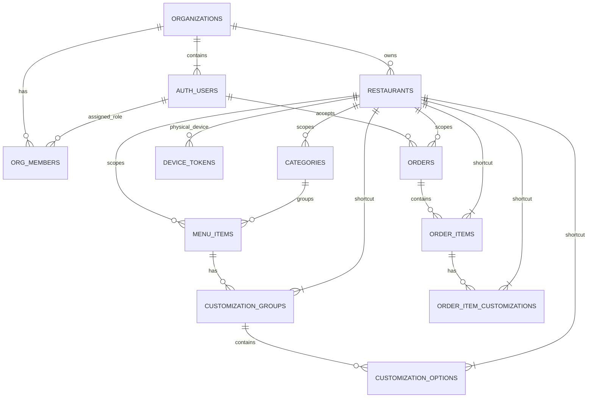

# Kiki Database Architecture

This diagram illustrates the current database schema. Notice how **every single operational table** directly connects back to `restaurants` (the branch level). This is what makes the architecture extremely secure and multi-tenant out of the box.

### Key Architectural Concepts

**1. Heavy Denormalization for RLS Speed**
You'll notice in the code that tables like `order_items` and even `customization_options` have a `restaurant_id` column. From a pure SQL optimization perspective, this is repetitive (since an `order_item` belongs to an `order`, which belongs to a `restaurant`). 
However, we do this intentionally! By duplicating the `restaurant_id` down the tree, Supabase's Row Level Security doesn't have to perform massive recursive SQL `JOIN` statements to figure out if an admin is allowed to see an item. It just checks `if (item.restaurant_id === user.restaurant_id)`.

**2. The Kiosk Identity**
When the physical kiosk tablet turns on, it trades its `device_token` for an anonymous JWT session. That token secretly holds a `restaurant_id` payload. This forces the Kiosk into exactly one branch's data silo, preventing it from accidentally ordering a burger from a branch 50 miles away.

**3. Supabase Realtime Channels**
Because everything relates to `restaurant_id`, opening a websocket to listen for new events is incredibly precise.
The admin POS app simply says: *"Only ping me if there is an `INSERT` on the `orders` table where `restaurant_id=X`."*
