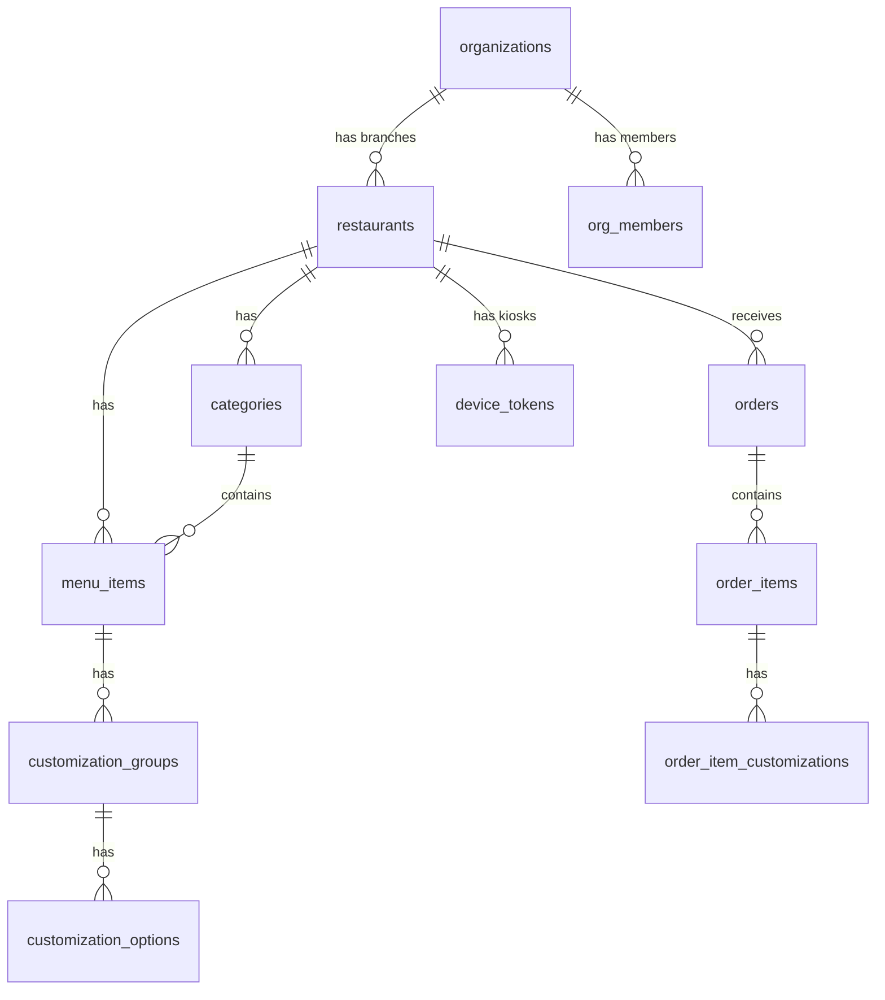

# Kiki — Supabase Backend Architecture

Multi-tenant backend powering the Kiosk (customer ordering), Admin POS (staff management), and KDS (kitchen display) apps. Supports **restaurant chains with multiple branches** via a two-level hierarchy: Organization → Restaurant(s).

## User Review Required

> [!IMPORTANT]
> **Multi-tenancy hierarchy**: `organizations` (the brand) → `restaurants` (individual branches). An owner of "Kiki Burgers" can manage all 3 branches from one account, while a staff member at "Kiki Centro" only sees that branch. All data isolation is enforced via RLS.

> [!IMPORTANT]
> **Auth model**: Two user types — `admin` (email+password, scoped to org or branch) and `kiosk_device` (automated device token per branch). Kiosks auto-authenticate on boot, no human login required.

> [!WARNING]
> **Menu sharing**: Each branch has its own menu and prices. If you want a "template menu" that syncs across branches, that would require an additional feature layer (not included here, but can be added later).

---

## Database Schema

### Entity Diagram



---

### `organizations`

The top-level entity. Represents a brand or company.

| Column | Type | Notes |
|---|---|---|
| [id](file:///Users/isabellamoraisabellamora/Desktop/Edgar/projects/kiki/apps/admin/src/screens/MenuScreen.tsx#249-296) | `uuid` PK | |
| `name` | `text` | Brand name, e.g. "Kiki Burgers" |
| `slug` | `text` UNIQUE | URL-safe, e.g. `kiki-burgers` |
| `logo_url` | `text` | Brand logo |
| `created_at` | `timestamptz` | |

---

### `restaurants` (branches)

Each physical location. Belongs to an organization.

| Column | Type | Notes |
|---|---|---|
| [id](file:///Users/isabellamoraisabellamora/Desktop/Edgar/projects/kiki/apps/admin/src/screens/MenuScreen.tsx#249-296) | `uuid` PK | |
| `org_id` | `uuid` FK → organizations | Parent brand |
| `name` | `text` | Branch name, e.g. "Kiki Centro" |
| `slug` | `text` UNIQUE | |
| `address` | `text` | |
| `is_open` | `boolean` | Controls kiosk availability |
| `timezone` | `text` | e.g. `Europe/Madrid` |
| `currency` | `text` | e.g. `EUR` |
| `tax_rate` | `numeric(5,4)` | e.g. `0.1000` for 10% |
| `created_at` | `timestamptz` | |

---

### `org_members` (replaces `users`)

Links Supabase Auth users to an organization + optional branch.

| Column | Type | Notes |
|---|---|---|
| [id](file:///Users/isabellamoraisabellamora/Desktop/Edgar/projects/kiki/apps/admin/src/screens/MenuScreen.tsx#249-296) | `uuid` PK | |
| `user_id` | `uuid` FK → auth.users | |
| `org_id` | `uuid` FK → organizations | |
| `restaurant_id` | `uuid` FK → restaurants | NULL = access to all branches |
| `role` | `text` | `owner`, `manager`, `staff` |
| `display_name` | `text` | |
| `created_at` | `timestamptz` | |

**Key rule**: If `restaurant_id` is NULL → user can access **all** branches (for owners). If set → user is scoped to that single branch only.

---

### `device_tokens`

Auto-login tokens for kiosk tablets. Scoped to a specific branch.

| Column | Type | Notes |
|---|---|---|
| [id](file:///Users/isabellamoraisabellamora/Desktop/Edgar/projects/kiki/apps/admin/src/screens/MenuScreen.tsx#249-296) | `uuid` PK | |
| `org_id` | `uuid` FK | |
| `restaurant_id` | `uuid` FK | Which branch |
| `device_name` | `text` | e.g. "Front Counter Kiosk" |
| `token_hash` | `text` | Hashed token |
| `is_active` | `boolean` | Admin can deactivate |
| `last_seen_at` | `timestamptz` | Heartbeat |
| `created_at` | `timestamptz` | |

---

### `categories`

| Column | Type | Notes |
|---|---|---|
| [id](file:///Users/isabellamoraisabellamora/Desktop/Edgar/projects/kiki/apps/admin/src/screens/MenuScreen.tsx#249-296) | `uuid` PK | |
| `restaurant_id` | `uuid` FK | Per-branch categories |
| `name` | `text` | |
| `slug` | `text` | |
| `icon` | `text` | Emoji |
| `sort_order` | `integer` | |
| `created_at` | `timestamptz` | |

---

### `menu_items`

| Column | Type | Notes |
|---|---|---|
| [id](file:///Users/isabellamoraisabellamora/Desktop/Edgar/projects/kiki/apps/admin/src/screens/MenuScreen.tsx#249-296) | `uuid` PK | |
| `restaurant_id` | `uuid` FK | |
| `category_id` | `uuid` FK | |
| `name` | `text` | |
| `description` | `text` | |
| `price` | `integer` | In cents |
| `image_url` | `text` | Supabase Storage URL |
| `available` | `boolean` | Toggle from admin |
| `popular` | `boolean` | Featured flag |
| `sort_order` | `integer` | |
| `created_at` | `timestamptz` | |

---

### `customization_groups`

| Column | Type | Notes |
|---|---|---|
| [id](file:///Users/isabellamoraisabellamora/Desktop/Edgar/projects/kiki/apps/admin/src/screens/MenuScreen.tsx#249-296) | `uuid` PK | |
| `menu_item_id` | `uuid` FK | |
| `restaurant_id` | `uuid` FK | Denormalized for RLS |
| `name` | `text` | e.g. "Patty Size" |
| `required` | `boolean` | |
| `max_selections` | `integer` | 1 = radio, >1 = multi |
| `sort_order` | `integer` | |

### `customization_options`

| Column | Type | Notes |
|---|---|---|
| [id](file:///Users/isabellamoraisabellamora/Desktop/Edgar/projects/kiki/apps/admin/src/screens/MenuScreen.tsx#249-296) | `uuid` PK | |
| `group_id` | `uuid` FK | |
| `restaurant_id` | `uuid` FK | Denormalized for RLS |
| `name` | `text` | e.g. "Triple" |
| `price_modifier` | `integer` | In cents (±) |
| `sort_order` | `integer` | |

---

### `orders`

| Column | Type | Notes |
|---|---|---|
| [id](file:///Users/isabellamoraisabellamora/Desktop/Edgar/projects/kiki/apps/admin/src/screens/MenuScreen.tsx#249-296) | `uuid` PK | |
| `restaurant_id` | `uuid` FK | Which branch |
| `order_number` | `integer` | Daily incrementing |
| `order_type` | `text` | `dine-in` / `takeaway` |
| `status` | `text` | `confirmed` → `preparing` → `ready` → `completed` |
| `subtotal` | `integer` | Cents |
| `tax` | `integer` | Cents |
| `total` | `integer` | Cents |
| `created_by` | `uuid` FK | Kiosk device user |
| `accepted_by` | `uuid` FK | Admin who accepted |
| `created_at` | `timestamptz` | |
| `updated_at` | `timestamptz` | |

### `order_items`

| Column | Type | Notes |
|---|---|---|
| [id](file:///Users/isabellamoraisabellamora/Desktop/Edgar/projects/kiki/apps/admin/src/screens/MenuScreen.tsx#249-296) | `uuid` PK | |
| `order_id` | `uuid` FK | |
| `restaurant_id` | `uuid` FK | Denormalized for RLS |
| `menu_item_id` | `uuid` FK | |
| `item_name` | `text` | Snapshot at time of order |
| `item_price` | `integer` | Snapshot |
| `quantity` | `integer` | |
| `line_total` | `integer` | Cents |

### `order_item_customizations`

| Column | Type | Notes |
|---|---|---|
| [id](file:///Users/isabellamoraisabellamora/Desktop/Edgar/projects/kiki/apps/admin/src/screens/MenuScreen.tsx#249-296) | `uuid` PK | |
| `order_item_id` | `uuid` FK | |
| `restaurant_id` | `uuid` FK | Denormalized for RLS |
| `group_name` | `text` | Snapshot |
| `option_name` | `text` | Snapshot |
| `price_modifier` | `integer` | Snapshot |

---

## Authentication Model

### Admin Users (Email + Password)
- Standard Supabase Auth signup/login
- On signup: creates an `organization` + first `restaurant` → gets `owner` role in `org_members`
- Owner invites staff → assigned to a specific branch with `staff` or `manager` role
- **Owner** (`restaurant_id = NULL`): sees all branches (aggregate dashboard, reports)
- **Manager / Staff** (`restaurant_id` set): sees only their assigned branch

### Kiosk Devices (Device Token)
- Admin generates a device token for a specific branch
- Kiosk uses token → Edge Function validates → returns a scoped JWT
- Kiosk user has `kiosk_device` role → RLS limits to: SELECT available menu items + INSERT orders
- The token locks the kiosk to one branch — it cannot see other branches' data

---

## Row Level Security (RLS)

Every table has RLS enabled. The core helper function:

```sql
CREATE FUNCTION get_user_restaurant_ids(uid uuid)
RETURNS uuid[] AS $$
  SELECT CASE
    -- If restaurant_id is NULL, user has access to ALL branches in their org
    WHEN m.restaurant_id IS NULL THEN
      ARRAY(SELECT r.id FROM restaurants r WHERE r.org_id = m.org_id)
    ELSE
      ARRAY[m.restaurant_id]
  END
  FROM org_members m WHERE m.user_id = uid
$$ LANGUAGE sql SECURITY DEFINER STABLE;
```

Then all policies use:
```sql
USING (restaurant_id = ANY(get_user_restaurant_ids(auth.uid())))
```

### Per-role restrictions

| Table | `kiosk_device` | `staff` / `manager` | `owner` |
|---|---|---|---|
| `organizations` | — | SELECT own | SELECT + UPDATE own |
| `restaurants` | SELECT own branch | SELECT own branch | ALL own org |
| `categories` | SELECT | ALL (own branch) | ALL |
| `menu_items` | SELECT (available only) | ALL (own branch) | ALL |
| `customization_*` | SELECT | ALL (own branch) | ALL |
| `orders` | INSERT + SELECT own | SELECT + UPDATE (own branch) | ALL |
| `order_items` | INSERT | SELECT (own branch) | ALL |
| `device_tokens` | — | SELECT (own branch) | ALL |

---

## Real-Time Subscriptions

| Table | Events | Consumer | Filter |
|---|---|---|---|
| `orders` | INSERT, UPDATE | Admin POS, KDS | `restaurant_id = ?` |
| `restaurants` | UPDATE | Kiosk | `id = ?` (is_open) |
| `menu_items` | INSERT, UPDATE, DELETE | Kiosk | `restaurant_id = ?` |

---

## Indexes

```sql
CREATE INDEX idx_restaurants_org ON restaurants(org_id);
CREATE INDEX idx_org_members_user ON org_members(user_id);
CREATE INDEX idx_org_members_org ON org_members(org_id);
CREATE INDEX idx_menu_items_restaurant ON menu_items(restaurant_id);
CREATE INDEX idx_orders_restaurant_status ON orders(restaurant_id, status);
CREATE INDEX idx_orders_restaurant_date ON orders(restaurant_id, created_at);
CREATE INDEX idx_order_items_order ON order_items(order_id);
CREATE INDEX idx_categories_restaurant ON categories(restaurant_id);
CREATE INDEX idx_customization_groups_item ON customization_groups(menu_item_id);
CREATE INDEX idx_customization_options_group ON customization_options(group_id);
CREATE INDEX idx_device_tokens_restaurant ON device_tokens(restaurant_id);
```

---

## Proposed Changes

### Supabase Setup

#### [NEW] [supabase/migrations/001_schema.sql](file:///Users/isabellamoraisabellamora/Desktop/Edgar/projects/kiki/supabase/migrations/001_schema.sql)
Full SQL migration: all tables, indexes, RLS policies, triggers.

#### [NEW] [supabase/migrations/002_functions.sql](file:///Users/isabellamoraisabellamora/Desktop/Edgar/projects/kiki/supabase/migrations/002_functions.sql)
Helper functions: `get_user_restaurant_ids()`, `get_next_order_number()`, `authenticate_device()`.

#### [NEW] [supabase/seed.sql](file:///Users/isabellamoraisabellamora/Desktop/Edgar/projects/kiki/supabase/seed.sql)
Seed data: one test org "Kiki Burgers" with 2 branches, sample menus, test admin.

---

### Shared Client Library

#### [NEW] [packages/supabase/index.ts](file:///Users/isabellamoraisabellamora/Desktop/Edgar/projects/kiki/packages/supabase/index.ts)
Shared Supabase client factory, generated types, and query helpers for all 3 apps.

---

## Verification Plan

### Automated Tests
- Run migration against local Supabase (`supabase db reset`)
- RLS test: kiosk at Branch A cannot read Branch B's menu
- RLS test: staff at Branch A cannot update Branch B's orders
- RLS test: owner can read/update both branches

### Manual Verification
- Create org + 2 branches, add menu items per branch
- Place order on Kiosk → appears real-time on Admin
- Toggle `is_open` → Kiosk shows closed state
- Staff login only sees their branch; owner sees both
