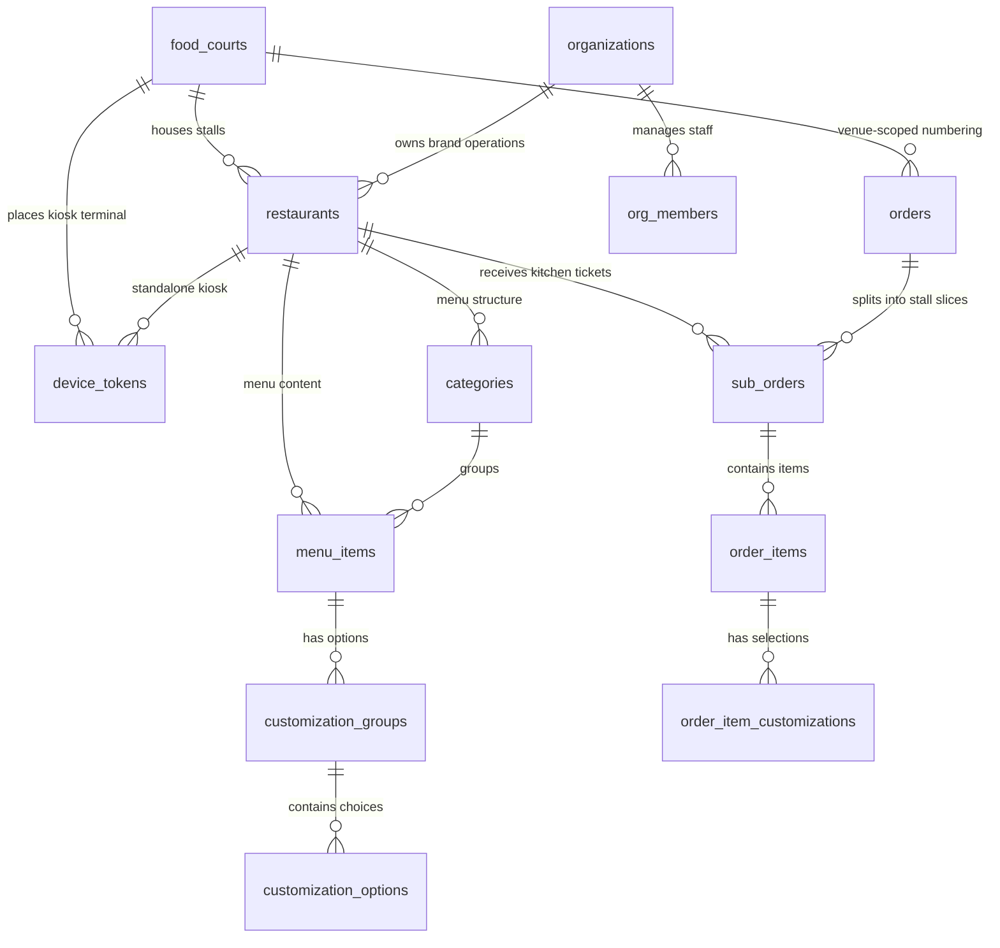

# Migration Plan: Food Court Support

> **Goal:** Extend the Kiki platform so a single Kiosk can serve as a directory for multiple restaurants inside a food court, while preserving full backward compatibility with standalone single-restaurant kiosks.

---

## 1. Summary of Changes

| Area | What changes |
|---|---|
| **Database** | New `food_courts` table, new `sub_orders` table, new columns on `orders`, `restaurants`, and `device_tokens` |
| **RLS Policies** | Updated to allow food-court-scoped kiosks to read menus from multiple restaurants |
| **Kiosk App** | New Directory Screen, dual-mode boot logic, unified cross-restaurant cart, realtime close/open handling |
| **Admin App** | Listens to `sub_orders` instead of `orders`, same UX otherwise |
| **Printer Service** | Prints `sub_order` items only (stall's slice), but references the parent `order_number` and `customer_name` |

---

## 2. Standalone vs Food Court — Side-by-Side Comparison

### 2.1 — Identity & Authentication

| Aspect | 🏪 Standalone | 🏬 Food Court |
|---|---|---|
| **Device token has** | `restaurant_id` set, `food_court_id` = NULL | `restaurant_id` = NULL, `food_court_id` set |
| **Kiosk sees menus from** | 1 restaurant | All restaurants in the food court |
| **RLS scope** | Single `restaurant_id` | All `restaurant_ids` WHERE `food_court_id` matches |

### 2.2 — Kiosk Boot & Navigation

| Aspect | 🏪 Standalone | 🏬 Food Court |
|---|---|---|
| **First screen** | Menu (categories + items) | Directory (restaurant cards) |
| **Directory screen?** | ❌ Skipped entirely | ✅ Shows all stalls |
| **Customer name input?** | Optional (can be skipped) | Recommended (staff call out names in noisy hall) |
| **Browse multiple menus?** | ❌ Only one restaurant | ✅ Tap a card → browse → back → tap another |

### 2.3 — Cart & Checkout

| Aspect | 🏪 Standalone | 🏬 Food Court |
|---|---|---|
| **Cart contains items from** | 1 restaurant | N restaurants |
| **Cart UI** | Flat list of items | Grouped by restaurant with headers |
| **Checkout creates** | 1 `order` + 1 `sub_order` + N `order_items` | 1 `order` + N `sub_orders` + N `order_items` |
| **Number of payments** | 1 | 1 (unified total) |

### 2.4 — Order Numbering

| Aspect | 🏪 Standalone | 🏬 Food Court |
|---|---|---|
| **Counter scoped to** | `restaurant_id` | `food_court_id` |
| **Resets daily?** | ✅ Starts at #101 each morning | ✅ Starts at #101 each morning |
| **Shared across stalls?** | N/A | ✅ All stalls in the food court share the same sequence |
| **Example** | Kiki Centro: #101, #102, #103 | Mall Plaza: #101 (burger+sushi), #102 (coffee only) |

### 2.5 — Order Structure

| Aspect | 🏪 Standalone | 🏬 Food Court |
|---|---|---|
| **`order` (parent)** | `restaurant_id` = set, `food_court_id` = NULL | `restaurant_id` = NULL, `food_court_id` = set |
| **`sub_orders` count** | Always 1 | 1 per restaurant in the cart |
| **`order.status`** | Mirrors the single `sub_order.status` | Auto-aggregated by trigger from all `sub_orders` |
| **`order.customer_name`** | Optional | Optional (but recommended) |

### 2.6 — Admin POS Behavior

| Aspect | 🏪 Standalone | 🏬 Food Court |
|---|---|---|
| **Subscribes to** | `sub_orders WHERE restaurant_id = mine` | `sub_orders WHERE restaurant_id = mine` |
| **Sees items from other stalls?** | N/A | ❌ Never — only their own `sub_order` |
| **Knows it's a food court order?** | No (doesn't matter) | No (doesn't matter) |
| **Status transitions** | Accept → Preparing → Ready → Complete | Accept → Preparing → Ready → Complete |
| **Ticket shows** | `order_number` + items | `order_number` + `customer_name` + items |

> **Key insight:** The Admin POS app code is identical for both modes. It only ever sees its own `sub_orders`. It doesn't know or care whether the order came from a standalone kiosk or a food court kiosk.

### 2.7 — Close/Open Behavior

| Aspect | 🏪 Standalone | 🏬 Food Court |
|---|---|---|
| **Admin toggles `is_open = false`** | Full-screen "Cerrados al momento" overlay. Entire kiosk is blocked. | That stall's card goes grey + "Cerrados al momento" badge. Other stalls remain orderable. |
| **Customer is browsing that menu** | Overlay covers everything | Kicked back to Directory + toast notification |
| **Cart has items from closed stall** | Cart is cleared (only 1 restaurant) | Only that stall's items are removed, rest of cart preserved |
| **ALL restaurants close** | Full-screen overlay | Full-screen overlay (same behavior) |
| **Restaurant reopens** | Overlay disappears, menu returns | Card restores to full color, becomes tappable |

### 2.8 — Printed Ticket

````carousel
**🏪 Standalone Ticket**
```
========================================
  KIKI BURGERS
========================================
  Order #101
  Type: DINE-IN
----------------------------------------
  1x Classic Smash         €10.99
     + Bacon               + €1.99
  1x Coca-Cola              €2.99
----------------------------------------
  TOTAL                    €15.97
========================================
```
<!-- slide -->
**🏬 Food Court Ticket (Burger Stall)**
```
========================================
  KIKI BURGERS
========================================
  Order #101 — Isabella
  Type: DINE-IN
----------------------------------------
  1x Classic Smash         €10.99
     + Bacon               + €1.99
  1x Coca-Cola              €2.99
----------------------------------------
  TOTAL                    €15.97
========================================
```
*Note: The sushi stall prints its own separate ticket with the same #101 but only sushi items.*
````

### 2.9 — Realtime Events

| Event | 🏪 Standalone | 🏬 Food Court |
|---|---|---|
| **New order placed** | 1 Realtime event on `sub_orders` | N Realtime events (1 per stall) on `sub_orders` |
| **Restaurant opens/closes** | Kiosk toggles full-screen overlay | Kiosk updates directory card color/state |
| **Menu item toggled available** | Item appears/disappears from menu | Item appears/disappears from that stall's menu |

---

## 3. Architecture Overview

### 3.1 — Entity Relationship (After Migration)



### 3.2 — Order Hierarchy

```
┌─────────────────────────────────────────────────┐
│  ORDER (Parent — Customer-facing)               │
│  #101 — "Isabella" — dine-in                    │
│  Grand Total: €25.97                            │
│  food_court_id: fc-001 (or NULL if standalone)  │
├─────────────────────────────────────────────────┤
│                                                 │
│  ┌──────────────────────┐  ┌──────────────────┐ │
│  │ SUB_ORDER (Stall A)  │  │ SUB_ORDER (B)    │ │
│  │ restaurant_id: r-001 │  │ restaurant_id:   │ │
│  │ status: preparing    │  │ r-002            │ │
│  │ total: €12.98        │  │ status: confirmed│ │
│  │                      │  │ total: €12.99    │ │
│  │ ├─ 1x Classic Smash  │  │ ├─ 1x Salmon Roll│ │
│  │ │  └─ + Bacon         │  │ └─ 1x Miso Soup │ │
│  │ └─ 1x Coca-Cola      │  │                  │ │
│  └──────────────────────┘  └──────────────────┘ │
└─────────────────────────────────────────────────┘
```

---

## 4. Database Migration (`002_food_courts.sql`)

### 4.1 — New Tables

```sql
-- ============================================================================
-- FOOD COURTS (physical venues that house multiple restaurant stalls)
-- ============================================================================
CREATE TABLE food_courts (
  id          uuid PRIMARY KEY DEFAULT uuid_generate_v4(),
  name        text NOT NULL,
  slug        text NOT NULL UNIQUE,
  address     text,
  logo_url    text,
  created_at  timestamptz NOT NULL DEFAULT now()
);

-- ============================================================================
-- SUB_ORDERS (per-stall slice of a parent order)
-- Each stall's POS only sees and manages its own sub_orders.
-- ============================================================================
CREATE TABLE sub_orders (
  id              uuid PRIMARY KEY DEFAULT uuid_generate_v4(),
  order_id        uuid NOT NULL REFERENCES orders(id) ON DELETE CASCADE,
  restaurant_id   uuid NOT NULL REFERENCES restaurants(id) ON DELETE CASCADE,
  order_number    integer NOT NULL,
  customer_name   text,
  order_type      text NOT NULL DEFAULT 'dine-in' CHECK (order_type IN ('dine-in', 'takeaway')),
  status          text NOT NULL DEFAULT 'confirmed'
                    CHECK (status IN ('confirmed', 'preparing', 'ready', 'completed', 'cancelled')),
  subtotal        integer NOT NULL DEFAULT 0,
  tax             integer NOT NULL DEFAULT 0,
  total           integer NOT NULL DEFAULT 0,
  created_at      timestamptz NOT NULL DEFAULT now(),
  updated_at      timestamptz NOT NULL DEFAULT now()
);

CREATE INDEX idx_sub_orders_order ON sub_orders(order_id);
CREATE INDEX idx_sub_orders_restaurant_status ON sub_orders(restaurant_id, status);

-- Auto-update updated_at
CREATE TRIGGER trg_sub_orders_updated_at
  BEFORE UPDATE ON sub_orders
  FOR EACH ROW EXECUTE FUNCTION update_updated_at();
```

### 4.2 — Altered Tables

```sql
-- Link restaurants to an optional food court
ALTER TABLE restaurants
ADD COLUMN food_court_id uuid REFERENCES food_courts(id) ON DELETE SET NULL;

CREATE INDEX idx_restaurants_food_court ON restaurants(food_court_id);

-- Parent order: optional food court scope + customer name
ALTER TABLE orders
ADD COLUMN food_court_id uuid REFERENCES food_courts(id) ON DELETE SET NULL,
ADD COLUMN customer_name text;

-- Device tokens: support food-court-scoped kiosks
ALTER TABLE device_tokens
ADD COLUMN food_court_id uuid REFERENCES food_courts(id) ON DELETE CASCADE;

-- Make restaurant_id nullable (food court kiosks don't have one)
ALTER TABLE device_tokens
ALTER COLUMN restaurant_id DROP NOT NULL;

-- Enforce exactly one scope: either restaurant OR food court, never both, never neither
ALTER TABLE device_tokens
ADD CONSTRAINT chk_device_scope CHECK (
  (restaurant_id IS NOT NULL AND food_court_id IS NULL)
  OR
  (restaurant_id IS NULL AND food_court_id IS NOT NULL)
);

-- Link order_items to sub_orders instead of directly to orders
ALTER TABLE order_items
ADD COLUMN sub_order_id uuid REFERENCES sub_orders(id) ON DELETE CASCADE;
```

### 4.3 — Order Number Generator

```sql
-- Atomically assigns the next sequential order number for today.
-- Scoped to food_court_id (food court mode) or restaurant_id (standalone mode).
-- Resets to 101 every day automatically.
CREATE OR REPLACE FUNCTION next_order_number(
  p_restaurant_id uuid DEFAULT NULL,
  p_food_court_id uuid DEFAULT NULL
) RETURNS integer AS $$
DECLARE
  next_num integer;
BEGIN
  IF p_food_court_id IS NOT NULL THEN
    SELECT COALESCE(MAX(order_number), 100) + 1 INTO next_num
    FROM orders
    WHERE food_court_id = p_food_court_id
      AND created_at >= CURRENT_DATE;
  ELSE
    SELECT COALESCE(MAX(order_number), 100) + 1 INTO next_num
    FROM orders
    WHERE restaurant_id = p_restaurant_id
      AND food_court_id IS NULL
      AND created_at >= CURRENT_DATE;
  END IF;

  RETURN next_num;
END;
$$ LANGUAGE plpgsql;
```

### 4.4 — RLS Policies for New Tables

```sql
-- Enable RLS
ALTER TABLE food_courts ENABLE ROW LEVEL SECURITY;
ALTER TABLE sub_orders ENABLE ROW LEVEL SECURITY;

-- Enable Realtime
ALTER PUBLICATION supabase_realtime ADD TABLE sub_orders;

-- ── food_courts ──────────────────────────────────────────────────────
-- Any authenticated user whose restaurant belongs to a food court can see it
CREATE POLICY "food_court_select" ON food_courts
  FOR SELECT USING (
    id IN (
      SELECT r.food_court_id FROM restaurants r
      WHERE r.id = ANY(get_user_restaurant_ids())
      AND r.food_court_id IS NOT NULL
    )
  );

-- ── sub_orders ───────────────────────────────────────────────────────
-- Each stall can only see/manage its own sub_orders
CREATE POLICY "sub_orders_select" ON sub_orders
  FOR SELECT USING (restaurant_id = ANY(get_user_restaurant_ids()));

CREATE POLICY "sub_orders_insert" ON sub_orders
  FOR INSERT WITH CHECK (restaurant_id = ANY(get_user_restaurant_ids()));

CREATE POLICY "sub_orders_update" ON sub_orders
  FOR UPDATE USING (
    restaurant_id = ANY(get_user_restaurant_ids())
    AND get_user_role() IN ('owner', 'manager', 'staff')
  );

-- ── orders (Parent) ──────────────────────────────────────────────────
-- Restaurant staff are EXPLICITLY DENIED access to the parent orders table
-- for food courts. They only interact with their denormalized `sub_orders`.
-- The parent table is only readable by Kiosks and Food Court Venue Admins.
```

### 4.5 — Auto-Aggregate Parent Order Status

When all sub_orders for a parent order reach `ready`, the parent order should automatically flip to `ready` too. This is handled by a trigger:

```sql
CREATE OR REPLACE FUNCTION sync_parent_order_status()
RETURNS TRIGGER AS $$
DECLARE
  all_ready boolean;
  any_preparing boolean;
BEGIN
  -- Check if ALL sub_orders for this parent are 'ready' or 'completed'
  SELECT
    bool_and(status IN ('ready', 'completed')),
    bool_or(status = 'preparing')
  INTO all_ready, any_preparing
  FROM sub_orders
  WHERE order_id = NEW.order_id;

  IF all_ready THEN
    UPDATE orders SET status = 'ready' WHERE id = NEW.order_id;
  ELSIF any_preparing THEN
    UPDATE orders SET status = 'preparing' WHERE id = NEW.order_id;
  END IF;

  RETURN NEW;
END;
$$ LANGUAGE plpgsql;

CREATE TRIGGER trg_sync_parent_order
  AFTER UPDATE ON sub_orders
  FOR EACH ROW
  WHEN (OLD.status IS DISTINCT FROM NEW.status)
  EXECUTE FUNCTION sync_parent_order_status();
```

---

## 5. Device Token Modes

The `device_tokens` table determines Kiosk behavior at boot:

| Field Set | Mode | Behavior |
|---|---|---|
| `restaurant_id` only | **Standalone** | Opens menu directly, single-restaurant cart |
| `food_court_id` only | **Food Court** | Opens Directory Screen, multi-restaurant cart |

Enforced by the `chk_device_scope` constraint — it is impossible to create an invalid token.

---

## 6. Kiosk App Changes

### 6.1 — Boot Flow

```
App starts
  └─ Authenticate with device_token
      └─ Read token payload
          ├─ restaurant_id is set → STANDALONE MODE
          │   ├─ Check restaurants.is_open
          │   │   ├─ true  → Navigate to MenuScreen
          │   │   └─ false → Navigate to ClosedScreen
          │   └─ Subscribe to Realtime on restaurants table
          │
          └─ food_court_id is set → FOOD COURT MODE
              ├─ Fetch all restaurants WHERE food_court_id = X
              ├─ Navigate to DirectoryScreen
              │   ├─ Open restaurants → tappable cards
              │   └─ Closed restaurants → greyed out + "Cerrados al momento"
              └─ Subscribe to Realtime on restaurants table
```

### 6.2 — Directory Screen (Food Court Only)

- Fetches `restaurants` filtered by `food_court_id`.
- Displays restaurant cards with logo, name, and cuisine type.
- **Open restaurants**: Full color, tappable → navigates to that restaurant's MenuScreen.
- **Closed restaurants**: Greyed out, non-tappable, badge reads *"Cerrados al momento"*.
- Listens to Realtime: if a restaurant's `is_open` changes, the card updates instantly.

### 6.3 — Cart (Food Court Mode)

The cart must support items from multiple restaurants:

```typescript
// Cart state shape for food court mode
interface CartState {
  items: CartItem[];  // each item has a restaurantId
  
  // Group items by restaurant for display and checkout
  getItemsByRestaurant: () => Map<string, CartItem[]>;
  
  // Remove all items from a specific restaurant (used when a stall closes)
  removeItemsByRestaurant: (restaurantId: string) => void;
}
```

At checkout, the Kiosk creates:
1. **1 parent `order`** with the grand total and `customer_name`.
2. **N `sub_orders`** — one per restaurant that has items in the cart.
3. **`order_items`** linked to their respective `sub_order_id`.

### 6.4 — Realtime Close/Open Handling

```
Realtime event: restaurant.is_open changed
│
├─ STANDALONE MODE
│   ├─ is_open = false → Full-screen "Cerrados al momento" overlay
│   └─ is_open = true  → Remove overlay, show menu
│
└─ FOOD COURT MODE
    ├─ is_open = false
    │   ├─ Grey out card on DirectoryScreen
    │   ├─ If customer is browsing that restaurant's menu
    │   │   └─ Kick back to DirectoryScreen + toast "Este restaurante acaba de cerrar"
    │   ├─ Remove that restaurant's items from cart
    │   │   └─ Toast: "[Name] cerró. Hemos eliminado sus productos."
    │   └─ If ALL restaurants are closed
    │       └─ Full-screen "Cerrados al momento" overlay
    │
    └─ is_open = true
        ├─ Restore card to full color on DirectoryScreen
        └─ If returning from all-closed state → remove overlay
```

---

## 7. Admin App Changes

### 7.1 — Listen to `sub_orders` Instead of `orders`

Currently the Admin POS subscribes to `orders`. After this migration, it will subscribe to `sub_orders`:

```typescript
// Before
supabase.channel(`orders-${restaurantId}`)
  .on('postgres_changes', { table: 'orders', filter: `restaurant_id=eq.${restaurantId}` }, ...)

// After
supabase.channel(`sub-orders-${restaurantId}`)
  .on('postgres_changes', { table: 'sub_orders', filter: `restaurant_id=eq.${restaurantId}` }, ...)
```

### 7.2 — Display Changes

- The order card now shows:
  - **Order Number** (from parent `order.order_number`) — e.g., `#101`
  - **Customer Name** (from parent `order.customer_name`) — e.g., `Isabella`
  - **Items** (from `sub_order → order_items`) — only this stall's items
  - **Sub-order Total** (from `sub_order.total`) — only this stall's revenue

### 7.3 — Status Transitions

The Admin POS manages the `sub_order.status`, not the parent `order.status`:
- **Accept** → sets `sub_order.status = 'preparing'`
- **Ready** → sets `sub_order.status = 'ready'`
- **Complete** → sets `sub_order.status = 'completed'`

The database trigger `sync_parent_order_status()` automatically updates the parent order when all sub_orders reach `ready`.

### 7.4 — Toggle Restaurant Open/Closed

The Admin Settings screen already has (or will have) a toggle for `is_open`:
```typescript
await supabase.from('restaurants').update({ is_open: false }).eq('id', restaurantId);
```

This works identically for standalone and food court stalls — the Kiosk handles the UI difference.

---

## 8. Printer Service Changes

Everything the printer needs now lives directly on the `sub_orders` table — **no join to the parent `orders` table required**.

| Field on ticket | Comes from |
|---|---|
| Restaurant name | `restaurants.name` (already available) |
| Order number | `sub_orders.order_number` |
| Customer name | `sub_orders.customer_name` |
| Items + prices | `order_items` via `sub_order_id` |
| Total | `sub_orders.total` |

```
========================================
  KIKI BURGERS
========================================
  Order #101 — Isabella
  Type: DINE-IN
----------------------------------------
  1x Classic Smash         €10.99
     + Bacon               + €1.99
  1x Coca-Cola              €2.99
----------------------------------------
  TOTAL                    €15.97
========================================
```

The `printerService.ts` function signature changes from `printTicket(order)` to `printTicket(subOrder)`. Since `sub_orders` is a self-contained, denormalized slice, the printer never needs to reach into the parent `orders` table.

---

## 9. Backward Compatibility

**Standalone kiosks continue to work identically.** The only structural difference is:
- Instead of inserting directly into `orders` + `order_items`, the Kiosk now inserts into `orders` + `sub_orders` + `order_items`.
- For a standalone kiosk, there is always exactly 1 `sub_order` per `order`.
- The Admin POS switches from listening to `orders` to `sub_orders` — the data shape is nearly identical.

No existing data is deleted or broken. The migration only adds new columns (all nullable) and new tables.

---

## 10. Migration — Step-by-Step Execution Plan

### Phase 1 — Database (no app changes yet)

> **Goal:** Get the new tables and columns live in Supabase. Nothing breaks because we're only adding — not modifying existing data.

| Step | Action | Details | Status |
|---|---|---|---|
| 1.1 | **Create migration file** | Write `supabase/migrations/007_food_courts.sql` containing all SQL from sections 4.1–4.5 of this doc | ✅ DONE |
| 1.2 | **Run migration locally** | `npx supabase db reset` to apply migrations on local Supabase instance | ✅ DONE |
| 1.3 | **Seed food court test data** | Insert into `food_courts`, link 3 existing restaurants to it, create a food-court-scoped device token | ✅ DONE |
| 1.4 | **Verify RLS** | Run manual SQL queries as different roles (kiosk anon token vs. staff JWT) to confirm visibility boundaries | ⏳ TODO |
| 1.5 | **Push to production** | `npx supabase db push` to apply the migration to the hosted Supabase project | ⏭️ SKIPPED (Will do at release) |

### Phase 2 — Admin App (switch to `sub_orders`)

> **Goal:** The Admin POS reads from `sub_orders` instead of `orders`. This is the only breaking change — but since sub_orders are denormalized, the data shape is nearly identical.

| Step | Action | Details | Status |
|---|---|---|---|
| 2.1 | **Update `useOrdersStore.ts`** | Change Supabase query from `orders` → `sub_orders`. Map `sub_order.order_number` and `sub_order.customer_name` into the existing `Order` type. Subscribe to Realtime on `sub_orders` instead of `orders`. | ✅ DONE |
| 2.2 | **Update `printerService.ts`** | Change `printTicket(order)` → `printTicket(subOrder)`. Pull `order_number` and `customer_name` from the sub_order directly. | ✅ DONE |
| 2.3 | **Update `OrderCard` / `OrderDetailsModal`** | Display `customer_name` if present (new line: "Order #101 — Isabella"). No change if `customer_name` is null. | ✅ DONE |
| 2.4 | **Update status transitions** | Ensure `accept()`, `markReady()`, and `complete()` operate on `sub_orders` table, not `orders`. | ✅ DONE |
| 2.5 | **Test standalone mode** | Place a test order via the Kiosk (which still writes to `orders` + `sub_orders`). Confirm the Admin POS displays and processes it correctly. | ✅ DONE |

### Phase 3 — Kiosk App (standalone mode first)

> **Goal:** Update the Kiosk to write `sub_orders` on checkout, but keep it in standalone mode. This ensures the existing flow still works before adding food court logic.

| Step | Action | Details | Status |
|---|---|---|---|
| 3.1 | **Update checkout flow** | On "Place Order", create: 1 `order` → 1 `sub_order` (copying `order_number` + `customer_name`) → N `order_items` linked via `sub_order_id`. | ✅ DONE |
| 3.2 | **Add `next_order_number()` RPC call** | Call the database function at checkout time to get the next sequential number for today. | ✅ DONE |
| 3.3 | **Add customer name input** | Optional text field on the checkout screen: "¿Cómo te llamas?" with a skip button. | ✅ DONE |
| 3.4 | **Add close/open handling** | Subscribe to Realtime on `restaurants`. If `is_open` flips to `false`, show full-screen "Cerrados al momento" overlay. | ✅ DONE |
| 3.5 | **End-to-end test** | Place order on Kiosk → confirm Admin POS receives it via `sub_orders` → print ticket → verify order number and customer name. | ⏳ TODO |

### Phase 4 — Kiosk App (food court mode)

> **Goal:** Add the Directory Screen and multi-restaurant cart. This is the big feature addition.

| Step | Action | Details | Status |
|---|---|---|---|
| 4.1 | **Add `useDeviceStore.ts`** | On boot, read device token payload. Determine `mode: 'standalone' \| 'food_court'` based on which field is set. Store `foodCourtId` or `restaurantId`. | ⏳ TODO |
| 4.2 | **Add `DirectoryScreen.tsx`** | Fetch `restaurants` filtered by `food_court_id`. Display cards with logo, name, cuisine. Grey out + "Cerrados al momento" badge for closed stalls. | ⏳ TODO |
| 4.3 | **Update `useCartStore.ts`** | Support items from multiple restaurants. Add `restaurantId` to each `CartItem`. Add `getItemsByRestaurant()` and `removeItemsByRestaurant()` methods. | ⏳ TODO |
| 4.4 | **Update `CartScreen.tsx`** | Group items by restaurant with section headers when in food court mode. Flat list when in standalone mode. | ⏳ TODO |
| 4.5 | **Update checkout flow** | In food court mode: create 1 `order` → N `sub_orders` (one per restaurant in cart) → distribute `order_items` to correct `sub_order_id`. | ⏳ TODO |
| 4.6 | **Add Realtime close/open handling** | If a stall closes: grey out card, kick customer out of that menu, remove that stall's items from cart, toast notification. | ⏳ TODO |
| 4.7 | **Update navigation** | Boot flow: standalone → `MenuScreen`, food court → `DirectoryScreen`. | ⏳ TODO |
| 4.8 | **End-to-end test** | Food court kiosk → add items from 2 stalls → checkout → 2 Admin POS devices each receive only their sub_order. | ⏳ TODO |

### Phase 5 — Verification & Deploy

> **Goal:** Final validation before shipping to hardware.

| Step | Action | Details | Status |
|---|---|---|---|
| 5.1 | **Standalone regression test** | Existing single-restaurant kiosk still works identically after all changes. | ⏳ TODO |
| 5.2 | **Food court full flow** | Directory → browse 3 stalls → mixed cart → checkout with customer name → 3 POS devices receive independent tickets. | ⏳ TODO |
| 5.3 | **Close/open test** | Toggle `is_open` on one stall while a customer is browsing. Verify correct behavior in both modes. | ⏳ TODO |
| 5.4 | **Order numbering test** | Place 5 orders across a food court. Verify numbers are sequential (#101–#105) and shared across all stalls. | ⏳ TODO |
| 5.5 | **Build APKs** | `eas build --platform android --profile preview` for both Admin and Kiosk apps. | ⏳ TODO |
| 5.6 | **Sideload & hardware test** | Install on Senraise POS + tablet. Run through full food court flow on physical hardware. | ⏳ TODO |
